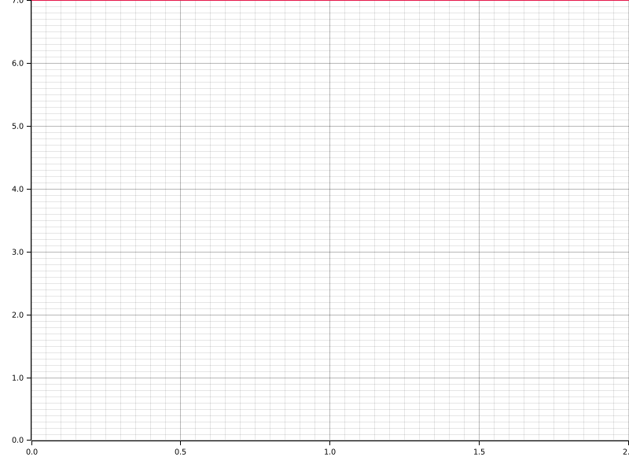

# Time Report for Building Directus Structures

The total time spent on all tasks was 12 seconds.
The slowest task was `Generating Code` which took 12 seconds (100.00% of all time).

| name            | time       | percentage | comment    |
|-----------------|------------|------------|------------|
| Generating Code | 12 seconds | 100.00%    | Unchanged. |

