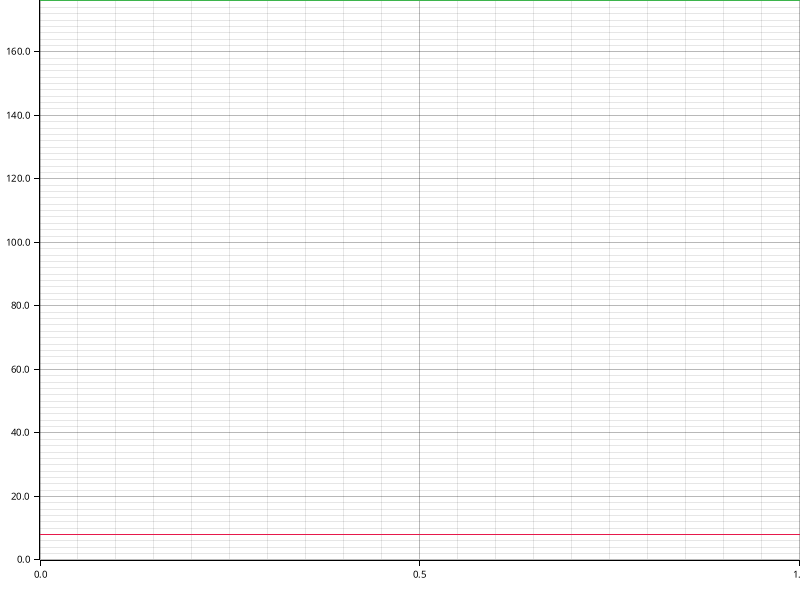

# Time Report for Test Init DB

The total time spent on all tasks was 3 minutes.
The slowest task was `Init DB` which took 2 minutes, 56 seconds, 33 ms, 709 µs and 516 ns (95.14% of all time).

| name              | time                                            | percentage | comment |
|-------------------|-------------------------------------------------|------------|---------|
| Booting up Docker | 8 seconds, 992 ms, 391 µs and 615 ns            | 4.32%      |         |
| Init DB           | 2 minutes, 56 seconds, 33 ms, 709 µs and 516 ns | 95.14%     |         |

## Time Report for Init DB

The total time spent on all tasks was 2 minutes.
The slowest task was `Init DB Transaction` which took 2 minutes, 56 seconds, 33 ms, 601 µs and 343 ns (100.00% of all time).

| name                | time                                            | percentage | comment |
|---------------------|-------------------------------------------------|------------|---------|
| Retrieve CSVs       | 108 µs and 173 ns                               | 0.00%      |         |
| Init DB Transaction | 2 minutes, 56 seconds, 33 ms, 601 µs and 343 ns | 100.00%    |         |

### Time Report for Init DB Transaction

The total time spent on all tasks was 2 minutes.
The slowest task was `Consistency Constraint Checks` which took 2 minutes, 51 seconds, 889 ms, 111 µs and 142 ns (97.16% of all time).

| name                          | time                                             | percentage | comment |
|-------------------------------|--------------------------------------------------|------------|---------|
| Initialize CSVs               | 3 seconds, 660 ms, 802 µs and 182 ns             | 1.70%      |         |
| Initialize Migrations         | 483 ms, 688 µs and 19 ns                         | 0.00%      |         |
| Consistency Constraint Checks | 2 minutes, 51 seconds, 889 ms, 111 µs and 142 ns | 97.16%     |         |

#### Time Report for Consistency Constraint Checks

The total time spent on all tasks was 2 minutes.
The slowest task was `Procedure and procedure template alignment` which took 2 minutes, 46 seconds, 844 ms, 215 µs and 889 ns (97.08% of all time).

| name                                               | time                                             | percentage | comment |
|----------------------------------------------------|--------------------------------------------------|------------|---------|
| Procedure and procedure template alignment         | 2 minutes, 46 seconds, 844 ms, 215 µs and 889 ns | 97.08%     |         |
| Check constraints in schema 'public'               | 4 seconds, 686 ms, 627 µs and 971 ns             | 2.34%      |         |
| Procedure and procedure template check constraints | 358 ms, 267 µs and 282 ns                        | 0.00%      |         |

##### Time Report for Check constraints in schema 'public'

The total time spent on all tasks was now.
The slowest task was `Compatible foreign type constraints` which took 4 seconds, 622 ms, 8 µs and 740 ns (100.00% of all time).

| name                                     | time                               | percentage | comment |
|------------------------------------------|------------------------------------|------------|---------|
| Compatible foreign type constraints      | 4 seconds, 622 ms, 8 µs and 740 ns | 100.00%    |         |
| Lowercase column and table names         | 52 ms, 965 µs and 533 ns           | 0.00%      |         |
| Standard column names and types          | 6 ms, 628 µs and 216 ns            | 0.00%      |         |
| Not-null constraints on standard columns | 3 ms, 959 µs and 950 ns            | 0.00%      |         |
| Word deprecation constraints             | 1 ms, 65 µs and 532 ns             | 0.00%      |         |

