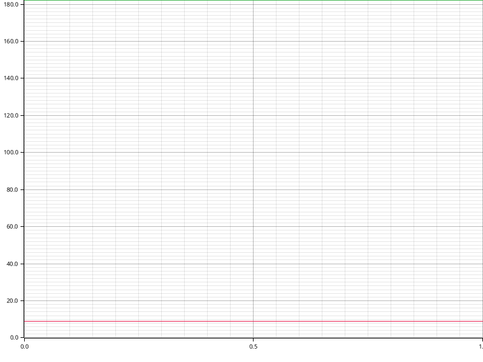

# Time Report for Test Init DB

The total time spent on all tasks was 5 minutes.
The slowest task was `Init DB` which took 5 minutes, 25 seconds, 977 ms, 511 µs and 461 ns (98.78% of all time).

| name              | time                                             | percentage | comment |
|-------------------|--------------------------------------------------|------------|---------|
| Booting up Docker | 3 seconds, 123 ms, 162 µs and 240 ns             | 0.91%      |         |
| Init DB           | 5 minutes, 25 seconds, 977 ms, 511 µs and 461 ns | 98.78%     |         |

## Time Report for Init DB

The total time spent on all tasks was 5 minutes.
The slowest task was `Init DB Transaction` which took 5 minutes, 25 seconds, 977 ms, 308 µs and 976 ns (100.00% of all time).

| name                | time                                             | percentage | comment |
|---------------------|--------------------------------------------------|------------|---------|
| Retrieve CSVs       | 202 µs and 485 ns                                | 0.00%      |         |
| Init DB Transaction | 5 minutes, 25 seconds, 977 ms, 308 µs and 976 ns | 100.00%    |         |

### Time Report for Init DB Transaction

The total time spent on all tasks was 5 minutes.
The slowest task was `Consistency Constraint Checks` which took 5 minutes, 19 seconds, 700 ms, 981 µs and 635 ns (98.15% of all time).

| name                          | time                                             | percentage | comment |
|-------------------------------|--------------------------------------------------|------------|---------|
| Initialize CSVs               | 5 seconds, 617 ms, 22 µs and 299 ns              | 1.54%      |         |
| Initialize Migrations         | 659 ms, 305 µs and 42 ns                         | 0.00%      |         |
| Consistency Constraint Checks | 5 minutes, 19 seconds, 700 ms, 981 µs and 635 ns | 98.15%     |         |

#### Time Report for Consistency Constraint Checks

The total time spent on all tasks was 5 minutes.
The slowest task was `Procedure and procedure template alignment` which took 5 minutes, 10 seconds, 788 ms, 941 µs and 753 ns (97.18% of all time).

| name                                               | time                                             | percentage | comment |
|----------------------------------------------------|--------------------------------------------------|------------|---------|
| Procedure and procedure template alignment         | 5 minutes, 10 seconds, 788 ms, 941 µs and 753 ns | 97.18%     |         |
| Check constraints in schema 'public'               | 7 seconds, 902 ms, 381 µs and 396 ns             | 2.19%      |         |
| Procedure and procedure template check constraints | 1 second, 9 ms, 658 µs and 486 ns                | 0.31%      |         |

##### Time Report for Check constraints in schema 'public'

The total time spent on all tasks was now.
The slowest task was `Compatible foreign type constraints` which took 7 seconds, 787 ms, 819 µs and 588 ns (100.00% of all time).

| name                                     | time                                 | percentage | comment |
|------------------------------------------|--------------------------------------|------------|---------|
| Compatible foreign type constraints      | 7 seconds, 787 ms, 819 µs and 588 ns | 100.00%    |         |
| Lowercase column and table names         | 82 ms, 289 µs and 895 ns             | 0.00%      |         |
| Standard column names and types          | 17 ms, 972 µs and 424 ns             | 0.00%      |         |
| Not-null constraints on standard columns | 11 ms, 286 µs and 310 ns             | 0.00%      |         |
| Word deprecation constraints             | 3 ms, 13 µs and 179 ns               | 0.00%      |         |

