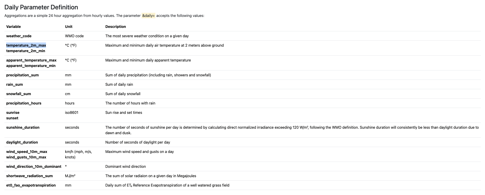

# Open-Meteo API

There are two types of data : 
- Daily
- Hourly

## Daily
The daily data has the following variables:


The units need to be specified as follows : 
```rust

// Wind speed unit
opts.wind_speed_unit = Some(open_meteo_rs::forecast::WindSpeedUnit::Kmh); // or
opts.wind_speed_unit = Some(open_meteo_rs::forecast::WindSpeedUnit::Ms); // or
opts.wind_speed_unit = Some(open_meteo_rs::forecast::WindSpeedUnit::Mph); // or
opts.wind_speed_unit = Some(open_meteo_rs::forecast::WindSpeedUnit::Kn); // or
opts.wind_speed_unit = Some("kmh".try_into().unwrap()); // or
opts.wind_speed_unit = Some("ms".try_into().unwrap()); // or
opts.wind_speed_unit = Some("mph".try_into().unwrap()); // or
opts.wind_speed_unit = Some("kn".try_into().unwrap());
```

We still need to discuss what kind of information we need. I don't think the elevation will be relevant for
us because we already have the map and the localization of the collector on the field. 

The units conversions could be done from us too. 