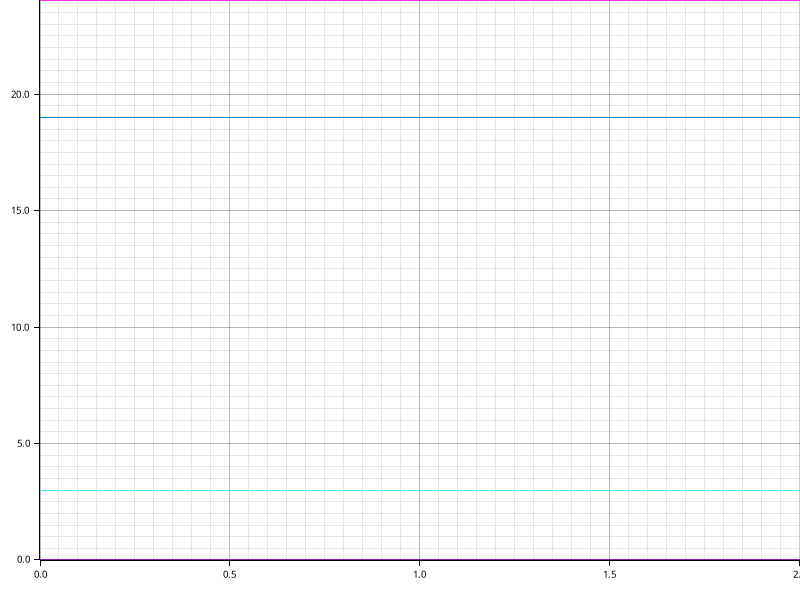

# Time Report for Building Core Structures

The total time spent on all tasks was 38 seconds.

The slowest task was `Building Schema from CSVs` which took 26 seconds (68.42% of all time).

+---------------------------------+------------+------------+------------+
| name                            | time       | percentage | comment    |
+---------------------------------+------------+------------+------------+
| Checking Migrations Directory   | now        | 0.00%      | Unchanged. |
+---------------------------------+------------+------------+------------+
| Creating Font Awesome Icons CSV | now        | 0.00%      | Unchanged. |
+---------------------------------+------------+------------+------------+
| Creating Taxonomical Ranks CSV  | now        | 0.00%      | Unchanged. |
+---------------------------------+------------+------------+------------+
| Building Schema from CSVs       | 26 seconds | 68.42%     | Unchanged. |
+---------------------------------+------------+------------+------------+
| Executing Migrations            | now        | 0.00%      | Unchanged. |
+---------------------------------+------------+------------+------------+
| Executing Meta-SQL              | now        | 0.00%      | Unchanged. |
+---------------------------------+------------+------------+------------+
| Checking Constraints            | now        | 10.53%     | Unchanged. |
+---------------------------------+------------+------------+------------+
| Generating Code                 | now        | 21.05%     | Unchanged. |
+---------------------------------+------------+------------+------------+
