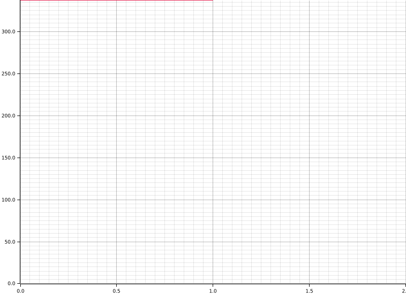

# Time Report for Building Core Structures

The total time spent on all tasks was 19 seconds.
The slowest task was `Setting up Docker and Database Connection` which took 8 seconds, 317 ms, 183 µs and 752 ns (42.11% of all time).

| name                                      | time                                 | percentage | comment |
|-------------------------------------------|--------------------------------------|------------|---------|
| Setting up Docker and Database Connection | 8 seconds, 317 ms, 183 µs and 752 ns | 42.11%     |         |
| Init DB                                   | 4 seconds, 325 ms, 778 µs and 583 ns | 21.05%     |         |
| Code Generation                           | 6 seconds, 671 ms, 930 µs and 644 ns | 31.58%     |         |

## Time Report for Init DB

The total time spent on all tasks was now.
The slowest task was `Init DB Transaction` which took 4 seconds, 325 ms, 666 µs and 713 ns (100.00% of all time).

| name                | time                                 | percentage | comment |
|---------------------|--------------------------------------|------------|---------|
| Retrieve CSVs       | 111 µs and 870 ns                    | 0.00%      |         |
| Init DB Transaction | 4 seconds, 325 ms, 666 µs and 713 ns | 100.00%    |         |

### Time Report for Init DB Transaction

The total time spent on all tasks was now.
The slowest task was `Initialize CSVs` which took 3 seconds, 838 ms, 849 µs and 7 ns (75.00% of all time).

| name                  | time                               | percentage | comment |
|-----------------------|------------------------------------|------------|---------|
| Initialize CSVs       | 3 seconds, 838 ms, 849 µs and 7 ns | 75.00%     |         |
| Initialize Migrations | 486 ms, 817 µs and 706 ns          | 0.00%      |         |

## Time Report for Code Generation

The total time spent on all tasks was now.
The slowest task was `Code generation` which took 6 seconds, 498 ms, 857 µs and 885 ns (100.00% of all time).

| name              | time                                 | percentage | comment |
|-------------------|--------------------------------------|------------|---------|
| Code generation   | 6 seconds, 498 ms, 857 µs and 885 ns | 100.00%    |         |
| Procedure Codegen | 173 ms, 72 µs and 759 ns             | 0.00%      |         |

### Time Report for Code generation

The total time spent on all tasks was now.
The slowest task was `Generate Structs` which took 5 seconds, 630 ms, 456 µs and 22 ns (83.33% of all time).

| name                             | time                                | percentage | comment |
|----------------------------------|-------------------------------------|------------|---------|
| Retrieving tables                | 11 ms, 942 µs and 884 ns            | 0.00%      |         |
| Creating table extension network | 26 ms, 882 µs and 568 ns            | 0.00%      |         |
| Generating Diesel code           | 141 ms, 453 µs and 964 ns           | 0.00%      |         |
| Generate Structs                 | 5 seconds, 630 ms, 456 µs and 22 ns | 83.33%     |         |
| Generate Web Common Traits       | 688 ms, 122 µs and 447 ns           | 0.00%      |         |

#### Time Report for Generating Diesel code

The total time spent on all tasks was now.
The slowest task was `Generating allow tables to appear in same query schema` which took 73 ms, 559 µs and 243 ns (NaN% of all time).

| name                                                   | time                     | percentage | comment |
|--------------------------------------------------------|--------------------------|------------|---------|
| Generating tables schema                               | 63 ms, 828 µs and 591 ns | NaN%       |         |
| Generating types schema                                | 4 ms, 66 µs and 130 ns   | NaN%       |         |
| Generating allow tables to appear in same query schema | 73 ms, 559 µs and 243 ns | NaN%       |         |

#### Time Report for Generate Structs

The total time spent on all tasks was now.
The slowest task was `Generate Table Structs` which took 5 seconds, 627 ms, 480 µs and 504 ns (100.00% of all time).

| name                   | time                                 | percentage | comment |
|------------------------|--------------------------------------|------------|---------|
| Generate Types Structs | 2 ms, 975 µs and 518 ns              | 0.00%      |         |
| Generate Table Structs | 5 seconds, 627 ms, 480 µs and 504 ns | 100.00%    |         |

#### Time Report for Generate Web Common Traits

The total time spent on all tasks was now.
The slowest task was `Generate Table Traits` which took 684 ms, 287 µs and 226 ns (NaN% of all time).

| name                  | time                      | percentage | comment |
|-----------------------|---------------------------|------------|---------|
| Generate Types Traits | 3 ms, 835 µs and 221 ns   | NaN%       |         |
| Generate Table Traits | 684 ms, 287 µs and 226 ns | NaN%       |         |

##### Time Report for Generate Table Traits

The total time spent on all tasks was now.
The slowest task was `Generate Insertable Traits` which took 393 ms, 93 µs and 803 ns (NaN% of all time).

| name                       | time                     | percentage | comment |
|----------------------------|--------------------------|------------|---------|
| Generate CRUD Traits       | 14 ms, 205 µs and 912 ns | NaN%       |         |
| Generate Deletable Traits  | 54 ms, 928 µs and 217 ns | NaN%       |         |
| Generate Upsertable Traits | 33 ms, 897 µs and 255 ns | NaN%       |         |
| Generate Foreign Traits    | 137 ms, 729 µs and 62 ns | NaN%       |         |
| Generate Insertable Traits | 393 ms, 93 µs and 803 ns | NaN%       |         |
| Generate Updatable Traits  | 50 ms, 432 µs and 977 ns | NaN%       |         |

### Time Report for Procedure Codegen

The total time spent on all tasks was now.
The slowest task was `procedure template Impl Codegen` which took 160 ms, 671 µs and 480 ns (NaN% of all time).

| name                            | time                      | percentage | comment |
|---------------------------------|---------------------------|------------|---------|
| Procedure Impl Codegen          | 12 ms, 401 µs and 279 ns  | NaN%       |         |
| procedure template Impl Codegen | 160 ms, 671 µs and 480 ns | NaN%       |         |

