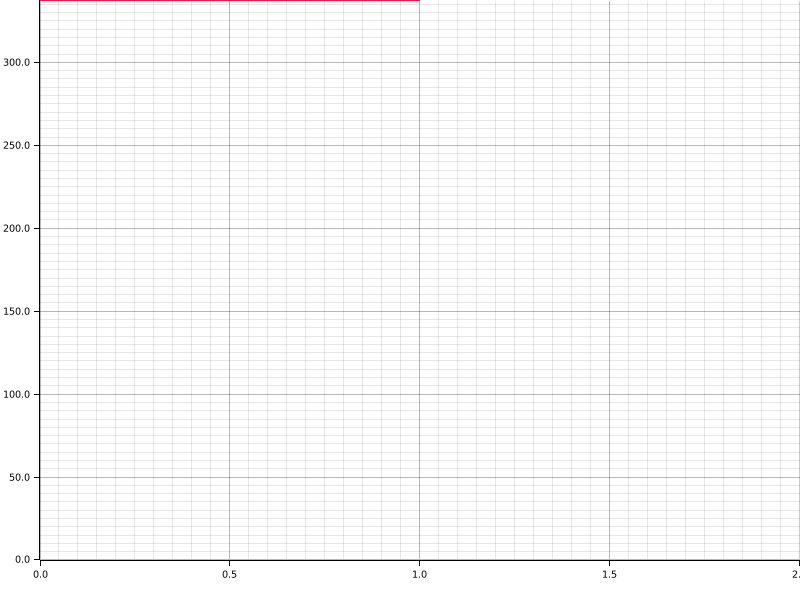

# Time Report for Building Core Structures

The total time spent on all tasks was 5 minutes.
The slowest task was `Code generation` which took 5 minutes (100.00% of all time).

| name            | time      | percentage | comment |
|-----------------|-----------|------------|---------|
| Code generation | 5 minutes | 100.00%    |         |

## Time Report for Code generation

The total time spent on all tasks was 5 minutes.
The slowest task was `Generate Structs` which took 5 minutes (92.28% of all time).

| name                            | time       | percentage | comment |
|---------------------------------|------------|------------|---------|
| Retrieving tables               | now        | 0.00%      |         |
| Creating column same-as network | now        | 0.00%      |         |
| Generating Diesel code          | 24 seconds | 7.12%      |         |
| Generate Structs                | 5 minutes  | 92.28%     |         |
| Generate Web Common Traits      | now        | 0.00%      |         |

### Time Report for Generating Diesel code

The total time spent on all tasks was 24 seconds.
The slowest task was `Generating allow tables to appear in same query schema` which took 24 seconds (100.00% of all time).

| name                                                   | time       | percentage | comment |
|--------------------------------------------------------|------------|------------|---------|
| Generating tables schema                               | now        | 0.00%      |         |
| Generating types schema                                | now        | 0.00%      |         |
| Generating allow tables to appear in same query schema | 24 seconds | 100.00%    |         |

### Time Report for Generate Structs

The total time spent on all tasks was 5 minutes.
The slowest task was `Generate Table Structs` which took 5 minutes (100.00% of all time).

| name                   | time      | percentage | comment |
|------------------------|-----------|------------|---------|
| Generate Types Structs | now       | 0.00%      |         |
| Generate Table Structs | 5 minutes | 100.00%    |         |

### Time Report for Generate Web Common Traits

The total time spent on all tasks was now.
The slowest task was `Generate Table Traits` which took now (NaN% of all time).

| name                  | time | percentage | comment |
|-----------------------|------|------------|---------|
| Generate Types Traits | now  | NaN%       |         |
| Generate Table Traits | now  | NaN%       |         |

#### Time Report for Generate Table Traits

The total time spent on all tasks was now.
The slowest task was `Generate Deletable Traits` which took now (NaN% of all time).

| name                       | time | percentage | comment |
|----------------------------|------|------------|---------|
| Generate CRUD Traits       | now  | NaN%       |         |
| Generate Deletable Traits  | now  | NaN%       |         |
| Generate Upsertable Traits | now  | NaN%       |         |
| Generate Foreign Traits    | now  | NaN%       |         |
| Generate Insertable Traits | now  | NaN%       |         |
| Generate Updatable Traits  | now  | NaN%       |         |

