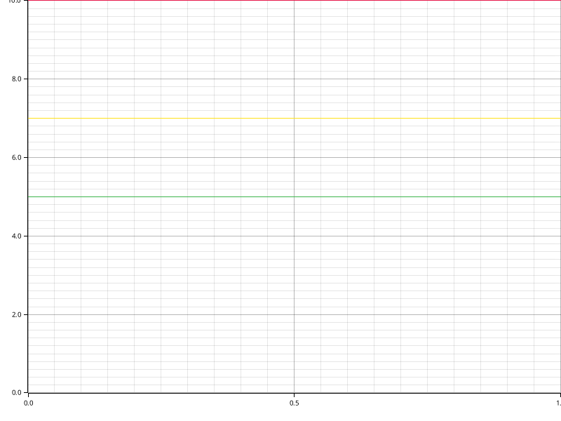

# Time Report for Building Core Structures

The total time spent on all tasks was 21 seconds.
The slowest task was `Setting up Docker and Database Connection` which took 7 seconds, 991 ms, 434 µs and 884 ns (33.33% of all time).

| name                                      | time                                 | percentage | comment |
|-------------------------------------------|--------------------------------------|------------|---------|
| Setting up Docker and Database Connection | 7 seconds, 991 ms, 434 µs and 884 ns | 33.33%     |         |
| Init DB                                   | 5 seconds, 670 ms, 413 µs and 855 ns | 23.81%     |         |
| Code Generation                           | 7 seconds, 610 ms, 532 µs and 811 ns | 33.33%     |         |

## Time Report for Init DB

The total time spent on all tasks was now.
The slowest task was `Init DB Transaction` which took 5 seconds, 670 ms, 291 µs and 650 ns (100.00% of all time).

| name                | time                                 | percentage | comment |
|---------------------|--------------------------------------|------------|---------|
| Retrieve CSVs       | 122 µs and 205 ns                    | 0.00%      |         |
| Init DB Transaction | 5 seconds, 670 ms, 291 µs and 650 ns | 100.00%    |         |

### Time Report for Init DB Transaction

The total time spent on all tasks was now.
The slowest task was `Initialize CSVs` which took 3 seconds, 896 ms, 338 µs and 886 ns (60.00% of all time).

| name                          | time                                 | percentage | comment |
|-------------------------------|--------------------------------------|------------|---------|
| Initialize CSVs               | 3 seconds, 896 ms, 338 µs and 886 ns | 60.00%     |         |
| Initialize Migrations         | 464 ms, 632 µs and 554 ns            | 0.00%      |         |
| Consistency Constraint Checks | 1 second, 309 ms, 320 µs and 210 ns  | 20.00%     |         |

#### Time Report for Consistency Constraint Checks

The total time spent on all tasks was now.
The slowest task was `Procedure and procedure template alignment` which took 746 ms, 5 µs and 259 ns (0.00% of all time).

| name                                               | time                      | percentage | comment |
|----------------------------------------------------|---------------------------|------------|---------|
| Procedure and procedure template alignment         | 746 ms, 5 µs and 259 ns   | 0.00%      |         |
| Check constraints in schema 'public'               | 154 ms, 687 µs and 119 ns | 0.00%      |         |
| Procedure and procedure template check constraints | 408 ms, 627 µs and 832 ns | 0.00%      |         |

##### Time Report for Check constraints in schema 'public'

The total time spent on all tasks was now.
The slowest task was `Compatible foreign type constraints` which took 141 ms, 845 µs and 558 ns (NaN% of all time).

| name                                     | time                      | percentage | comment |
|------------------------------------------|---------------------------|------------|---------|
| Compatible foreign type constraints      | 141 ms, 845 µs and 558 ns | NaN%       |         |
| Lowercase column and table names         | 1 ms, 117 µs and 984 ns   | NaN%       |         |
| Standard column names and types          | 6 ms, 499 µs and 575 ns   | NaN%       |         |
| Not-null constraints on standard columns | 3 ms, 957 µs and 504 ns   | NaN%       |         |
| Word deprecation constraints             | 1 ms, 266 µs and 498 ns   | NaN%       |         |

## Time Report for Code Generation

The total time spent on all tasks was now.
The slowest task was `Code generation` which took 7 seconds, 425 ms, 723 µs and 774 ns (100.00% of all time).

| name              | time                                 | percentage | comment |
|-------------------|--------------------------------------|------------|---------|
| Code generation   | 7 seconds, 425 ms, 723 µs and 774 ns | 100.00%    |         |
| Procedure Codegen | 184 ms, 809 µs and 37 ns             | 0.00%      |         |

### Time Report for Code generation

The total time spent on all tasks was now.
The slowest task was `Generate Structs` which took 6 seconds, 755 ms, 268 µs and 704 ns (85.71% of all time).

| name                             | time                                 | percentage | comment |
|----------------------------------|--------------------------------------|------------|---------|
| Retrieving tables                | 287 µs and 555 ns                    | 0.00%      |         |
| Creating table extension network | 24 ms, 28 µs and 96 ns               | 0.00%      |         |
| Generating Diesel code           | 28 ms, 582 µs and 446 ns             | 0.00%      |         |
| Generate Structs                 | 6 seconds, 755 ms, 268 µs and 704 ns | 85.71%     |         |
| Generate Web Common Traits       | 617 ms, 556 µs and 973 ns            | 0.00%      |         |

#### Time Report for Generating Diesel code

The total time spent on all tasks was now.
The slowest task was `Generating allow tables to appear in same query schema` which took 15 ms, 7 µs and 743 ns (NaN% of all time).

| name                                                   | time                   | percentage | comment |
|--------------------------------------------------------|------------------------|------------|---------|
| Generating tables schema                               | 9 ms, 99 µs and 624 ns | NaN%       |         |
| Generating types schema                                | 4 ms, 475 µs and 79 ns | NaN%       |         |
| Generating allow tables to appear in same query schema | 15 ms, 7 µs and 743 ns | NaN%       |         |

#### Time Report for Generate Structs

The total time spent on all tasks was now.
The slowest task was `Generate Table Structs` which took 6 seconds, 752 ms, 77 µs and 200 ns (100.00% of all time).

| name                   | time                                | percentage | comment |
|------------------------|-------------------------------------|------------|---------|
| Generate Types Structs | 3 ms, 191 µs and 504 ns             | 0.00%      |         |
| Generate Table Structs | 6 seconds, 752 ms, 77 µs and 200 ns | 100.00%    |         |

#### Time Report for Generate Web Common Traits

The total time spent on all tasks was now.
The slowest task was `Generate Table Traits` which took 614 ms, 722 µs and 209 ns (NaN% of all time).

| name                  | time                      | percentage | comment |
|-----------------------|---------------------------|------------|---------|
| Generate Types Traits | 2 ms, 834 µs and 764 ns   | NaN%       |         |
| Generate Table Traits | 614 ms, 722 µs and 209 ns | NaN%       |         |

##### Time Report for Generate Table Traits

The total time spent on all tasks was now.
The slowest task was `Generate Insertable Traits` which took 338 ms, 269 µs and 488 ns (NaN% of all time).

| name                       | time                      | percentage | comment |
|----------------------------|---------------------------|------------|---------|
| Generate CRUD Traits       | 15 ms, 70 µs and 758 ns   | NaN%       |         |
| Generate Deletable Traits  | 33 ms, 286 µs and 440 ns  | NaN%       |         |
| Generate Upsertable Traits | 35 ms, 322 µs and 624 ns  | NaN%       |         |
| Generate Foreign Traits    | 138 ms, 897 µs and 723 ns | NaN%       |         |
| Generate Insertable Traits | 338 ms, 269 µs and 488 ns | NaN%       |         |
| Generate Updatable Traits  | 53 ms, 875 µs and 176 ns  | NaN%       |         |

### Time Report for Procedure Codegen

The total time spent on all tasks was now.
The slowest task was `procedure template Impl Codegen` which took 172 ms, 357 µs and 135 ns (NaN% of all time).

| name                            | time                      | percentage | comment |
|---------------------------------|---------------------------|------------|---------|
| Procedure Impl Codegen          | 12 ms, 451 µs and 902 ns  | NaN%       |         |
| procedure template Impl Codegen | 172 ms, 357 µs and 135 ns | NaN%       |         |

