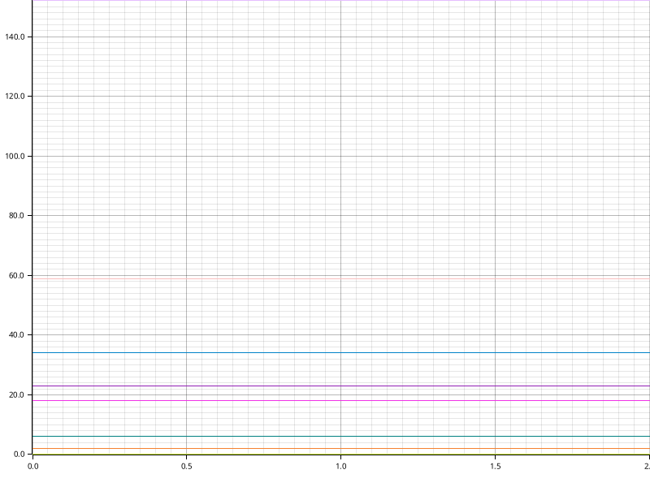

# Time Report for Building Core Structures

The total time spent on all tasks was 5 minutes.

The slowest task was `Generating Code` which took 3 minutes (58.68% of all time).

+-------------------------------------+------------+------------+------------+
| name                                | time       | percentage | comment    |
+-------------------------------------+------------+------------+------------+
| Checking Migrations Directory       | now        | 0.00%      | Unchanged. |
+-------------------------------------+------------+------------+------------+
| Creating Font Awesome Icons CSV     | now        | 0.00%      | Unchanged. |
+-------------------------------------+------------+------------+------------+
| Creating Taxonomical Ranks CSV      | now        | 0.00%      | Unchanged. |
+-------------------------------------+------------+------------+------------+
| Fetching NCBI Taxonomy              | 34 seconds | 10.73%     | Unchanged. |
+-------------------------------------+------------+------------+------------+
| Creating Taxonomy CSV               | now        | 0.63%      | Unchanged. |
+-------------------------------------+------------+------------+------------+
| Building SQL from CSVs              | 23 seconds | 7.26%      | Unchanged. |
+-------------------------------------+------------+------------+------------+
| Establishing Connection to Postgres | now        | 0.00%      | Unchanged. |
+-------------------------------------+------------+------------+------------+
| Executing CSQLV SQL                 | 17 seconds | 5.36%      | Unchanged. |
+-------------------------------------+------------+------------+------------+
| Executing Migrations                | now        | 0.00%      | Unchanged. |
+-------------------------------------+------------+------------+------------+
| Executing Meta-SQL                  | 45 seconds | 14.20%     | Unchanged. |
+-------------------------------------+------------+------------+------------+
| Checking Constraints                | now        | 1.89%      | Unchanged. |
+-------------------------------------+------------+------------+------------+
| Generating Code                     | 3 minutes  | 58.68%     | Unchanged. |
+-------------------------------------+------------+------------+------------+
