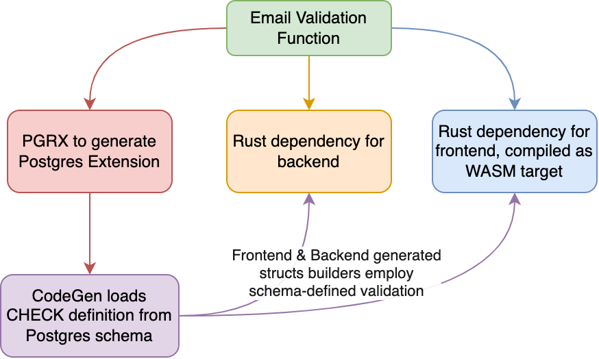

# PGRX Validation

Cross-compile target validation of common web components.

## Overview

Data validation is foundamental in any application. In a web application, data may be validated several times:

* First, when the user inputs data in a form. Here there may a function that, for instance, checks whether the user has entered a valid email address.
* Second, when the data is sent to the server. Here, again, since data submitted from the client can be tampered with, the server must validate the data, and check that it is in the expected format. The email from the previous example must be checked again.
* Thirdly, the data is stored in a database. Since we cannot necessarily trust that all developers working on the project have implemented the same validation rules, the database must also validate the data. Not all data insertions script are written by experienced developer, and data integrity is crucial, expecially in the case of Earth Metabolome Initiative, which aims to provide data in the first place.

Re-defining a validation multiple times is a waste of time, and prone to errors as if the validation rules are changed, they must be changed in multiple places. In this library, we define the validation rules in a single place, and then compile it to different targets.

## Getting started

Please read the [CONTRIB.md](CONTRIB.md) file for instructions on how to get started.
