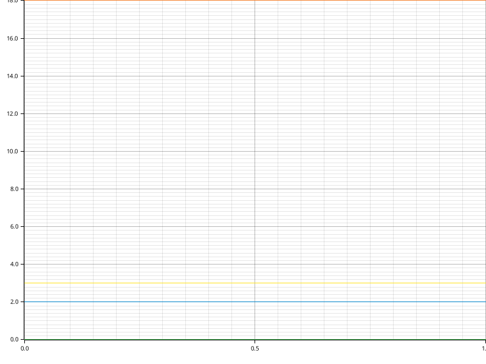

# Time Report for EMI Workspace Generation Test

The total time spent on all tasks was 21 seconds.
The slowest task was `Checking Generated Workspace` which took 16 seconds, 442 ms, 9 µs and 253 ns (74.74% of all time).

| name                         | time                                 | percentage | comment |
|------------------------------|--------------------------------------|------------|---------|
| Database Parsing             | 3 seconds, 546 ms, 927 µs and 438 ns | 16.12%     |         |
| Schema Validation            | 655 ms, 913 µs and 289 ns            | 2.98%      |         |
| SQL Workspace Generation     | 1 second, 133 ms, 218 µs and 827 ns  | 5.15%      |         |
| Formatting Workspace         | 219 ms, 545 µs and 258 ns            | 1.00%      |         |
| Checking Generated Workspace | 16 seconds, 442 ms, 9 µs and 253 ns  | 74.74%     |         |

## Time Report for SQL Workspace Generation

The total time spent on all tasks was now.
The slowest task was `writing_crate_lib` which took 1 second, 111 ms, 414 µs and 256 ns (98.08% of all time).

| name               | time                                | percentage | comment |
|--------------------|-------------------------------------|------------|---------|
| writing_crate_toml | 17 ms, 778 µs and 12 ns             | 1.57%      |         |
| writing_crate_lib  | 1 second, 111 ms, 414 µs and 256 ns | 98.08%     |         |
| workspace_toml     | 3 ms, 933 µs and 729 ns             | 0.35%      |         |
| workspace_rustfmt  | 92 µs and 830 ns                    | 0.01%      |         |

