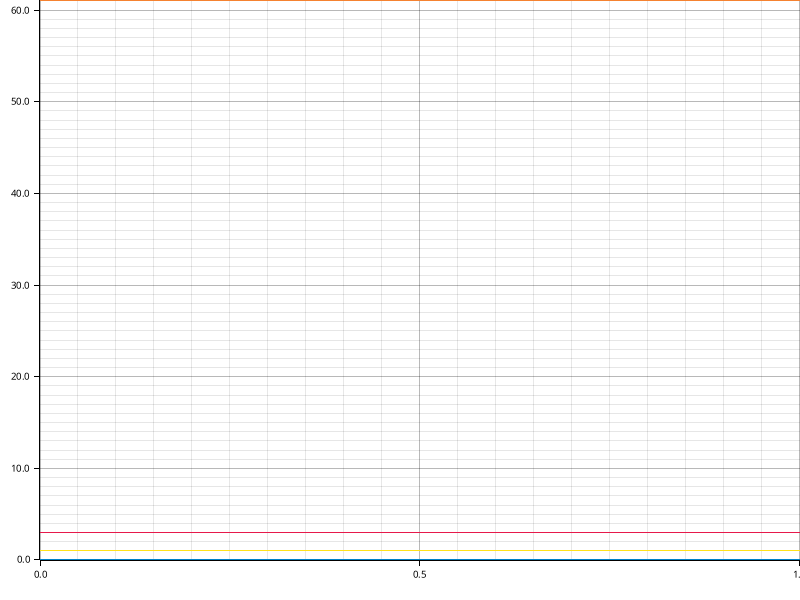

# Time Report for EMI Workspace Generation Test

The total time spent on all tasks was 23 seconds.
The slowest task was `Checking Generated Workspace` which took 18 seconds, 58 ms, 991 µs and 396 ns (76.46% of all time).

| name                         | time                                 | percentage | comment |
|------------------------------|--------------------------------------|------------|---------|
| Database Parsing             | 3 seconds, 403 ms, 59 µs and 223 ns  | 14.41%     |         |
| Schema Validation            | 685 ms, 103 µs and 409 ns            | 2.90%      |         |
| SQL Workspace Generation     | 1 second, 272 ms, 542 µs and 227 ns  | 5.39%      |         |
| Formatting Workspace         | 199 ms, 820 µs and 983 ns            | 0.85%      |         |
| Checking Generated Workspace | 18 seconds, 58 ms, 991 µs and 396 ns | 76.46%     |         |

## Time Report for SQL Workspace Generation

The total time spent on all tasks was now.
The slowest task was `writing_crate_lib` which took 1 second, 252 ms, 139 µs and 162 ns (98.40% of all time).

| name               | time                                | percentage | comment |
|--------------------|-------------------------------------|------------|---------|
| writing_crate_toml | 16 ms, 741 µs and 980 ns            | 1.32%      |         |
| writing_crate_lib  | 1 second, 252 ms, 139 µs and 162 ns | 98.40%     |         |
| workspace_toml     | 3 ms, 594 µs and 974 ns             | 0.28%      |         |
| workspace_rustfmt  | 66 µs and 111 ns                    | 0.01%      |         |

